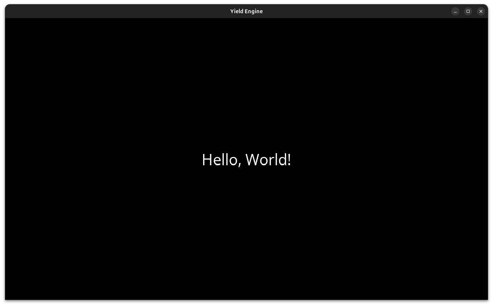

# Yield Engine Hello World Demo - Simple Text Rendering Application

This project demonstrates a basic implementation of the Xebisco Yield Engine, showcasing how to create a window and render text. The application creates a simple scene that displays "Hello, World!" text, serving as a starting point for developers to understand the basic functionality of the Yield Engine.

The project utilizes the engine's core components to set up a game loop context, create a scene, and render text. It demonstrates fundamental concepts such as scene management, entity creation, and the engine's threading system. This example is particularly useful for developers who are getting started with the engine and want to understand its basic architecture.



## Module Structure
```
hello-world/
├── src/
│   └── Main.java    # Entry point of the application, contains scene setup.
```

## Instructions

Creating a basic scene with text:
```java
import com.xebisco.yieldengine.core.*;

public class Main {
    public static void main(String[] args) throws Exception {
        // Initialize the game loop context with window dimensions
        LoopContext loop = Global.getOpenGLOpenALLoopContext(1280, 720);
        
        // Create a new scene
        Scene scene = new Scene();

        // Add text entity to the scene
        scene.getEntityFactories().add(Global.textFactory("Hello, World!"));

        // Set and initialize the scene
        Global.setCurrentScene(scene);
        scene.create();

        // Start the game loop
        loop.startThread();
    }
}
```

### Component interactions:
1. Global utils initializes OpenGL and OpenAL systems
2. Scene container manages entity lifecycle and rendering
3. Text factory creates text component and add to the entity within the scene
4. Game loop thread coordinates updates and rendering
5. Entity system manages text display and positioning

### Troubleshooting
Common issues and solutions:

1. Window Not Displaying
- Problem: Black screen or window not appearing
- Solution:
    * Verify OpenGL drivers are up to date
    * Check if the window dimensions are valid
    * Ensure the scene is properly set using `Global.setCurrentScene()`

2. Text Not Rendering
- Problem: Window appears but no text is visible
- Solution:
    * Confirm the text factory was added to the scene's entity factories
    * Verify the scene's `create()` method was called
    * Check for any exceptions in the console output